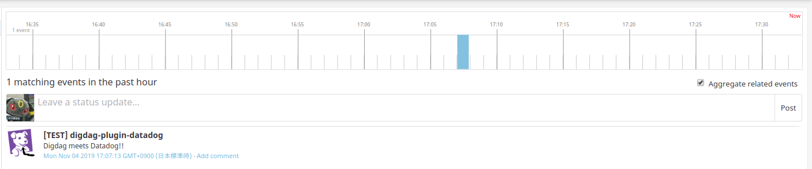

# digdag-plugin-datadog

This [Digdag](https://www.digdag.io) plugin provides operators of [Datadog](https://www.datadoghq.com).

## Getting Started

### Add Datadog API key and Application key

Currently, only environment variables are supported.

```bash
export DATADOG_API_KEY=<your api key>
export DATADOG_APP_KEY=<your application key>
export DATADOG_SITE=<your site> # Optional, "US" or "EU", default is "US"
```

### Add the plugin setting to your workflow.

```yaml
_export:
  plugin:
    dependencies:
      - dev.nomadblacky:digdag-plugin-datadog_2.13:0.1.0
```

## Operators

There are full examples in the [`examples`](./examples) directory.

### datadog_event>: Send a event to Datadog.

```yaml
+example:
  datadog_event>:
    title: "[TEST] digdag-plugin-datadog"
    text: "Digdag meets Datadog!!"
```


