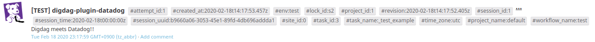

# digdag-plugin-datadog

This [Digdag](https://www.digdag.io) plugin provides operators of [Datadog](https://www.datadoghq.com).

[](https://scala-steward.org)


## Getting Started

### 1. Add Datadog API key and Application key

#### From environment variables

```bash
export DATADOG_API_KEY=<your api key>
export DATADOG_APP_KEY=<your application key>
export DATADOG_SITE=<your site> # Optional, "US" or "EU", default is "US"
```

#### From Digdag secrets

```bash
digdag secrets --local --set datadog.api_key=<your api key>
digdag secrets --local --set datadog.app_key=<your apppplication key>
digdag secrets --local --set datadog.site=<your site> # Optional, "US" or "EU", default is "US"
```

If keys are set to both, the plugin use keys from secrets.

### 2. Add the plugin setting to your workflow.

The latest release version is... 

```yaml
_export:
  plugin:
    dependencies:
      - dev.nomadblacky:digdag-plugin-datadog_2.13:<version>
```

## Operators

There are full examples in the [`examples`](./examples) directory.

### datadog_event>: Send an event to Datadog.

```yaml
+example:
  datadog_event>:
    title: "[TEST] digdag-plugin-datadog"
    text: "Digdag meets Datadog!!"
```



#### Options

+ **title**: [required, string] The event title. Limited to 100 characters.
+ **text**: [required, string] The body of the event. Limited to 4000 characters. The text supports markdown.
+ **tags**: [optional, array of string] A list of tags to apply to the event.
+ **alert_type**: [optional, enum, default=`info`] If it’s an alert event, set its type between: `error`, `warning`, `info`, and `success`.
+ **priority**: [optional, enum, default=`normal`] The priority of the event: `normal` or `low`.
